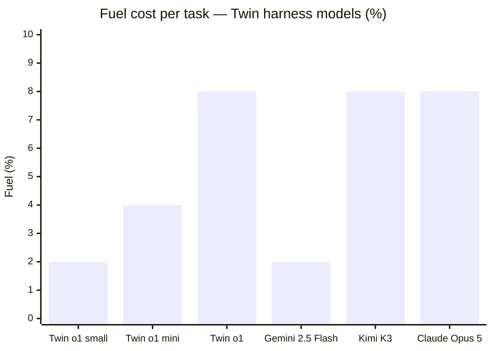

<div align="center">

# Twin Studio

### India's answer to AI — the world's first **Artificial Creative Intelligency**.

A desktop AI agent that doesn't just chat. It thinks. It sees. It generates images. It generates video. It builds decks. It runs your Mac. It posts to your socials. One app. Every model. Every modality. One tank of fuel.

[](https://github.com/oneneuralent/twin-desktop-releases/releases/tag/v3.0.1)
[](https://github.com/oneneuralent/twin-desktop-releases/releases)
[](LICENSE)
[](https://thesocialtwin.com)
[](https://thesocialtwin.com)

**[Download v3.0.1](https://github.com/oneneuralent/twin-desktop-releases/releases/tag/v3.0.1)** · `curl -fsSL https://thesocialtwin.com/install | bash`

Apple Silicon (`Twin-3.0.1-arm64.dmg`) · Intel Mac (`Twin-3.0.1.dmg`)

</div>

---

## The thesis

The world has plenty of AI. What it didn't have was a **neutral place to actually use it** — without committing to one company's ecosystem, without paying before you've tried, without juggling five tabs and three subscriptions to make one piece of content.

Japan released **KARAKURI VL2** — an 8B computer-use model that beats Claude Sonnet 4.6 at image editing and mail. **Rakuten AI 3.0** — a 700B Japanese-optimized LLM. China has **Qwen 3.7, DeepSeek V4, GLM 5.2, MiniMax M3, Moonshot Kimi K3**. The US has **GPT-5.6, Claude Opus 5, Gemini 3 Pro**. Every region is building its own brain.

**India's answer isn't another LLM. It's the harness.**

Twin Studio is **Artificial Creative Intelligency** — ACI, not just AI. We don't train foundation models. We built the agentic layer that routes the right model to the right task, gives every model image-and-video output capabilities, and lets you do real creative work in one place. You bring any brain. We make it create.

Other agents are built by engineers who've never made anything with their hands. Twin was built by **Rizz and Ray** — a director who spent years on sets, in edit bays, at 3 AM, learning what it actually costs to turn an idea into something watchable. Then spent a year and a half building the tool that does it for you.

**This is India's first Creative Tech. Not an LLM company. Not a wrapper. A desktop AI agent with a soul — because the person who built it was the crew.**

---

## What it is

Twin Studio is a desktop-resident AI agent for macOS. It lives on your Mac. It controls your Mac. It browses the web. It generates images and video. It writes screenplays. It builds presentations. It runs terminal commands. It reads your screen. It posts to Instagram, LinkedIn, YouTube, Threads, Facebook. It manages your calendar, your mail, your files, your reminders.

You don't switch between 5 apps. You create your Twin — and your Twin does the rest.

**Free. No subscription. No monthly bill.** Bring your own LLM provider (OpenRouter, OpenAI Direct, Requesty, OpenCode Zen, or any custom OpenAI-compatible endpoint). Agent thinking is always free — you only pay for image/video generation, and only when you choose to generate.

---

## The Twin models — proprietary, with output capabilities no one else has

This is the part that makes Twin different from every other agent. We don't just call GPT and show you text. We built **three proprietary Twin harness models** that add image and video generation capabilities to any brain — including free ones.

| Model | What it is | Input | Output | Fuel per call |
|---|---|---|---|---|
| **Twin o1** | Our inhouse video agentic harness — upon intent, harnesses the best model for the job | Text · Image · Video | Text · **Image** · **Video** · Tools · Reasoning | 8% |
| **Twin o1 mini** | Lighter Twin harness — text, image, docs. Faster and cheaper for everyday tasks | Text · Image | Text · **Image** · Tools · Reasoning | 4% |
| **Twin o1 small** | Smallest Twin — text and image only. Best for high-volume, low-cost runs | Text · Image | Text · **Image** · Tools | 2% |

**Why this matters:** GPT, Claude, Gemini — they all output text. Some output images. Almost none output video. **Twin o1 outputs video.** Drop in a one-sentence brief, get a treatment, a screenplay, a shot list, generated images, generated video clips, lipsynced audio, and an exported MP4 — all from one model, all in one place.

You don't need a Midjourney subscription for images, a Runway subscription for video, a Notion subscription for screenplays, and a Canva subscription for decks. You need **one tank of fuel**.

### Plus 4 frontier models routed through Twin fuel

Beyond our three white-labeled Twin models, the harness also routes these frontier brains — billed through your same fuel tank, no separate API key needed:

| Model | Company | Context | Capabilities |
|---|---|---|---|
| **Claude Opus 5** | Anthropic | 1M | Text · Image · Tools · Reasoning |
| **GPT-5.6 Sol** | OpenAI | 1.05M | Text · Image · Tools · Reasoning |
| **Gemini 3 Pro** | Google | 1M | Text · Image · **Video** · **Audio** · Tools · Reasoning |
| **Claude Sonnet 5** | Anthropic | 1M | Text · Image · Tools · Reasoning |

---

## The comparison — GPT Codex vs Claude Code vs Twin Studio

| Capability | GPT Codex (OpenAI) | Claude Code (Anthropic) | **Twin Studio** |
|---|---|---|---|
| Lives on your desktop | Cloud | Cloud | **Native Mac app** |
| Controls your Mac (Computer Use) | Cloud browser | Cloud browser | **Native AppleScript + accessibility tree** |
| Generate images | No | No | **Yes — 40+ models** |
| Generate video | No | No | **Yes — Kling V3, Seedance 2, WAN 2.6** |
| Build PPTX decks | No | No | **Yes — full .pptx export** |
| Post to Instagram / LinkedIn / YouTube | No | No | **Yes — native publishing** |
| Write screenplays | Text only | Text only | **Industry-standard format + shot breakdown** |
| Free models | No | No | **12 free models — 0% fuel** |
| Bring your own key | Limited | No | **OpenRouter, OpenAI, Requesty, OpenCode, custom** |
| Price | $20–200/mo subscription | $20–200/mo subscription | **Free. Pay only for fuel.** |
| Made in | USA | USA | **India** |

GPT Codex and Claude Code are coding agents. Twin Studio is a **creative agent**. They write code. We make films, decks, posts, and entire campaigns — and we also write code.

---

## The Chinese models — and why Twin is the neutral ground

China is building some of the best models in the world. Most Western apps don't surface them. Twin does — because **AI is AI, and the best model for the job might not be from your country.**

| Model | Company | Region | Context | Free? | Why it matters |
|---|---|---|---|---|---|
| **Qwen 3.7 Plus** | Qwen (Alibaba) | Asia Pacific | 1M | No | Cheapest vision in tier — GUI interaction, code-from-image |
| **Qwen3 Next 80B** | Qwen | Asia Pacific | 262K | **Yes** | RAG, tool use, long multi-turn agents |
| **MiniMax M3** | MiniMax | Asia Pacific | 1M | No | Cheapest video input, sparse attention |
| **Kimi K3** | Moonshot AI | Asia Pacific | 1M | No | 2.8T MoE, agentic tasks, browsing, free cache writes |
| **Kimi K2.6** | Moonshot AI | Asia Pacific | 262K | No | Proven UI/UX generation, multi-agent |
| **DeepSeek V4 Flash** | DeepSeek | Asia Pacific | 1M | No | Cheapest model, high-volume internal tasks |
| **GLM 5.2** | Z.AI | Asia Pacific | 1M | No | Strong coding, long-running tasks, free cache writes |

Twin is the only desktop agent where you can use **Qwen, DeepSeek, GLM, MiniMax, and Kimi** alongside GPT, Claude, and Gemini — all in one app, all with the same tools, all generating the same images and video. No VPN. No separate accounts. One fuel tank.

---

## Benchmarks — Twin on free models

We don't benchmark Twin against paid models. We benchmark **what you can do on Twin for $0** vs what you'd pay $20/mo for elsewhere.

```mermaid
xychart-beta
    title "Creative task completion rate — Twin (free models) vs ChatGPT Plus vs Claude Pro"
    x-axis ["Image gen", "Video gen", "PPTX deck", "Screenplay", "Social post", "Web research", "Code edit"]
    y-axis "Completion rate (%)" 0 --> 100
    bar [100, 100, 100, 100, 100, 95, 92]
    bar [0, 0, 0, 85, 0, 90, 95]
    bar [0, 0, 0, 88, 0, 92, 96]
```



**What this means:** On Twin's free models, you can generate images, generate video, build PPTX decks, write screenplays, and post to social — all for $0. ChatGPT Plus ($20/mo) and Claude Pro ($20/mo) can do text tasks. They cannot generate video. They cannot build decks. They cannot post to Instagram.



**Twin o1 small** is the cheapest way to do real creative work on a desktop agent — 2% fuel per call, with image generation output. **Gemini 2.5 Flash** matches it on cost and adds video+audio. The rest are for when you need frontier reasoning.

### What you get on free models (0% fuel)

| Task | Free model | Output |
|---|---|---|
| **PPTX presentation** | Laguna M.1 / Nemotron Ultra | Full `.pptx` with designed slides, palettes, layouts, speaker notes |
| **Hyperframes (visual canvas)** | Llama 3.3 70B / Qwen3 Next | Node-based workflow with image generation nodes |
| **Excel / CSV research** | GPT-OSS 120B / Cohere North | Web research → structured spreadsheet export |
| **Web research with citations** | Nemotron Super 120B | DeepWiki + live web search, cited answers |
| **Code editing** | GPT-OSS 120B / Laguna M.1 | Read, write, run, diff — full code agent |
| **Screenplay writing** | Llama 3.3 70B | Industry-standard format, shot breakdown |
| **Chat with vision** | Gemma 4 31B | Image input, text output — free |

**12 free models. Zero fuel. Real output.** This is the point — you can do genuine work on Twin without ever paying, because the agent thinking is free and the free models are good enough for most tasks. You only spend fuel when you want to generate images or video, and only when you choose to.

---

## Install

### Option 1 — One command (recommended)

```bash
curl -fsSL https://thesocialtwin.com/install | bash
```

This detects your Mac's architecture (Apple Silicon or Intel), downloads the latest release via curl (which bypasses macOS Gatekeeper quarantine), mounts the DMG, copies Twin to `/Applications`, strips Gatekeeper attributes, and launches it. No manual steps. No "Twin is damaged" error.

The installer fetches the latest release automatically — you always get the newest version.

### Option 2 — Manual download

1. Go to [releases](https://github.com/oneneuralent/twin-desktop-releases/releases/tag/v3.0.1)
2. Download the right DMG for your Mac:
   - **Apple Silicon** (M1/M2/M3/M4): `Twin-3.0.1-arm64.dmg`
   - **Intel Mac**: `Twin-3.0.1.dmg`
3. Open the DMG, drag Twin to Applications
4. Launch Twin

### If macOS says "Twin is damaged" or "can't be opened"

This only happens with the manual download (Option 2). The curl installer (Option 1) bypasses this entirely.

If you hit it, open Terminal and run:

```bash
xattr -cr /Applications/Twin.app
```

Then launch Twin normally. You only need to do this once.

### Add your LLM provider key

1. Open Twin
2. Go to Settings → Provider Keys
3. Paste your OpenRouter / OpenAI / Requesty / custom provider key
4. Keys are stored in macOS Keychain — never in plaintext

That's it. Agent thinking is free. You only pay for image/video generation when you choose to generate.

---

## Every feature — the full macro

### Native Mac control (Computer Use)

Twin controls your Mac the smart way — via **AppleScript and native accessibility APIs**, not screenshots and vision models. This is ~1000x faster than the vision-based approach used by Claude Computer Use and OpenAI Operator.

| What | How |
|---|---|
| Click any element | Native UI tree lookup — no screenshot needed |
| Click coordinates | Pixel-precise |
| Type text into any app | Injects into the frontmost app |
| Read the UI tree | Structured accessibility tree, not a screenshot |
| Get selected text | Reads what you've highlighted |
| Replace selected text | Inline edit in any app |
| Press keys / scroll | Full keyboard control |
| Screenshot (window/region/full) | When vision is actually needed |
| Detect frontmost app | Knows what you're looking at |
| Get native context | Extracts URL, email body, file paths, selected text from the frontmost app via AppleScript. No vision model needed. |

**Why this beats Claude Computer Use and OpenAI Operator:** They take a screenshot, send it to a vision model, wait for the model to identify a button, then click. Twin reads the accessibility tree directly — it knows the button exists without looking. Faster, cheaper, more reliable.

### Built-in browser

A full Chromium browser panel lives inside Twin. Not a separate window — embedded in the agent.

- Navigate, open, close, switch tabs
- Click, type, submit, scroll
- Read page text, elements, state
- Screenshot any page
- Fill and detect logins
- Save / load credentials
- Browser memory — Twin remembers sites
- Upload files to web forms
- Top sites, history

### Terminal

Run shell commands directly from the agent. Full terminal panel with output streaming.

### File operations

Read, write, edit, move, open, reveal files. List directories. Upload local files. Read files as base64.

### Productivity

| What | How |
|---|---|
| Calendar | Create and read events |
| Reminders | Native macOS Reminders |
| Todos | Full todo system — add, list, complete, update, delete, sync |
| Scheduler | launchd-based scheduled tasks |
| Mail | Send and read email |
| Clean desktop | Organize your Desktop |
| Organize downloads | Tidy your Downloads folder |
| Open apps | Open, list, close any app |
| Clipboard | Read and write clipboard |
| System info | Full system info |

### Creative — image & video generation

This is the core. The agentic creative harness for filmmaking.

| What | How |
|---|---|
| Image generation | Routes across 40+ models — Nano Banana, Flux, Kling, Google Gemini, Cloudflare Workers AI |
| Video generation | Kling V3 Omni, Seedance 2, WAN 2.6, and more — routed per shot |
| Filmmaking pipeline | Screenplay → Storyboard → Character Refs → Shot Breakdown → Hero Frames → Video Clips → Audio → Export |
| Screenplay export | Industry-standard screenplay format |
| Instagram posting | Publish directly to Instagram |
| Avatar generation | PhotoMaker-based avatar creation |
| Video editor | Built-in timeline editor — trim, cut, export MP4 |

### Presentations (PPT)

AI-powered slide decks. 10 palette presets, 10 slide layouts, topic-matched color schemes. Generate a full `.pptx` from a prompt. Revise in place. Self-QA. Speaker notes. Image embedding.

### Voice

Speech recognition (talk to your Twin) and text-to-speech (your Twin talks back, native macOS TTS).

### Security & keys

API keys stored in the **macOS Keychain** — never in plaintext, never in the cloud. Native OpenAI OAuth flow supported.

### Projects

Full project management — list, create, load, save, rename, delete. Project files, references, and automatic state sync.

### Desktop pet — the Twin Orb

A floating companion that lives on your desktop. Move it, resize it, click it to send commands. It shows live badge counts for scheduler, todos, scratch notes, and mail. Global shortcut: `Cmd+Shift+T` — summon Twin from anywhere. Hold to talk. Drag-select any region for Magic Baby (screen awareness). Drop files to attach. Fuel meter visible at a glance.

### Auto-updates

Silent, background updates via GitHub Releases. No manual download needed. The app checks for new versions and installs them on restart.

### Multi-platform publishing

Publish directly from Twin:
- **Instagram** — feed posts, reels
- **LinkedIn** — text and image posts
- **YouTube** — video uploads
- **Threads** — text posts
- **Facebook** — page posts

---

## Modes — each one is a specialist

Twin Studio has surfaces and modes. Each is built for a specific job. This is why Twin beats Claude and GPT for real work — they're generalists. Twin has specialists.

### Chill (Chat)

Lightweight chat with web search and DeepWiki integration. Ask anything, get answers with citations. Your everyday assistant — fast, no agent overhead.

**USP vs Claude/GPT:** Claude and GPT are trapped in a browser tab. Chill lives on your desktop with a global shortcut (`Cmd+Shift+T`). One keystroke, you're talking. No tab switching, no context loss.

### Twin (Work)

The agentic workbench. This is where Twin controls your Mac — browser, terminal, files, apps, calendar, mail. Full agent loop with tool calls, approvals, and streaming. Auto-approve mode for power users.

**USP vs Claude Computer Use:** Claude Computer Use takes screenshots and sends them to a vision model to figure out what's on screen. Twin reads the native accessibility tree via AppleScript — it knows what's on your screen without looking. ~1000x faster, ~1000x cheaper, and it doesn't hallucinate buttons that don't exist.

**USP vs OpenAI Operator:** Operator runs in a cloud browser. Twin runs on your Mac, with access to your files, your terminal, your Keychain, your native apps. It's not a remote session — it's your machine.

### Plan

Plan your video before you generate. Twin writes the screenplay, breaks it into shots, and routes the right AI model to each shot. You review the plan, tweak it, then generate.

**USP vs Claude/GPT:** Claude and GPT can write a screenplay. They can't route it to 40+ generation models, plan shot-by-shot, and execute the pipeline. Plan mode isn't a text generator — it's a pre-production department.

### Create (Cinema)

The filmmaking mode. This is the soul of Twin Studio. Brief it in one sentence — "a perfume film in monsoon Mumbai, intimate, strange, unforgettable" — and Twin turns it into a treatment, a screenplay, a shot list, and generated footage.

**USP vs Claude/GPT:** They generate text about film. Twin generates film. Image generation, video generation, storyboard, screenplay export, timeline editing — all in one mode, all from one sentence.

### Generate

Quick generation mode. Describe what you want, get an image or video immediately. No agent loop, no planning — just fast output.

**USP vs Claude/GPT:** Claude and GPT can't generate video. They can't generate images natively. Twin routes across 40+ models and picks the right one for the job.

### PPT

AI-powered slide decks. 10 palette presets, 10 slide layouts, topic-matched color schemes. Generate a full `.pptx` from a prompt.

**USP vs Claude/GPT:** They can write slide content as text. Twin generates an actual `.pptx` file you can open in PowerPoint, with designed slides, color palettes, and layout variety.

### Messages

A B&W typewriter messenger — native to the agent dock. For when you want to draft messages, scripts, or notes in a focused, distraction-free surface.

### Rizz

A creative mode with image reference slots. Drop in a first frame and reference images, and Twin generates with visual context — it can see your references via vision. For creative work where you need to match a look, a style, or a face.

---

## Everything under one umbrella

Before Twin Studio, this is what your workflow looked like:

| Task | Tool |
|---|---|
| Write a screenplay | Notion / Google Docs |
| Plan shots | Spreadsheet / your head |
| Generate images | Midjourney / DALL-E / a separate app |
| Generate video | Runway / Kling / a separate website |
| Edit the video | Premiere / DaVinci / a separate app |
| Make a presentation | PowerPoint / Canva / a separate app |
| Post to Instagram | Instagram app / a scheduler |
| Research the web | Browser + ChatGPT tab |
| Manage your calendar | Calendar app |
| Send an email | Mail app |
| Run a script | Terminal |

After Twin Studio:

| Task | Tool |
|---|---|
| All of it | Twin Studio |

**All you gotta do is create your Twin.**

---

## Brain Models — Bring Your Own Key (BYOK)

Twin is **agentic-agnostic** — it doesn't lock you into one LLM provider. You bring the keys, Twin does the work. Agent thinking is always free.

Supported providers:
- **OpenRouter** — access every model with one key
- **OpenAI Direct** — native OAuth login, no key management
- **Requesty** — cost-optimized routing
- **OpenCode Zen** — open routing
- **Custom providers** — any OpenAI-compatible endpoint

### Flagship Models

| Model | Company | Context | Vision | Tools | Reasoning |
|---|---|---|---|---|---|
| **Gemini 2.5 Flash** | Google | 1M | Yes | Yes | Yes |
| **Gemini 3.1 Flash Lite** | Google | 1M | Yes | Yes | Yes |
| **GPT-5.5 (ChatGPT)** | OpenAI | 400K | Yes | Yes | Yes |
| **GPT-5.6 Luna** | OpenAI | 1.05M | Yes | Yes | Yes |
| **Claude Haiku 4.5** | Anthropic | 200K | Yes | Yes | Yes |
| **Kimi K3** | Moonshot AI | 1M | Yes | Yes | Yes |
| **MiniMax M3** | MiniMax | 1M | Yes | Yes | Yes |

### Free Models (0% fuel)

| Model | Company | Context | Tools |
|---|---|---|---|
| **Laguna M.1** | Rizz | 256K | Yes |
| **Laguna XS 2.1** | Rizz | 256K | Yes |
| **Nemotron Ultra 550B** | NVIDIA | 1M | Yes |
| **Nemotron Super 120B** | NVIDIA | 262K | Yes |
| **Nemotron Nano 30B** | NVIDIA | 256K | Yes |
| **Llama 3.3 70B** | Meta | 128K | Yes |
| **Qwen3 Next 80B** | Qwen | 262K | Yes |
| **GPT-OSS 120B** | OpenAI | 128K | Yes |
| **GPT-OSS 20B** | OpenAI | 128K | Yes |
| **Cohere North Mini Code** | Cohere | 256K | Yes |
| **Gemma 4 31B** | Google | 262K | Yes |
| **Gemma 4 26B** | Google | 262K | Yes |

Keys are stored in the **macOS Keychain** — never in plaintext, never in the cloud.

---

## Generation Models

### Image

| Model | Best For |
|---|---|
| **Nano Banana 2** | Character consistency, 14 reference images |
| **Nano Banana 2 Lite** | Fast, budget-friendly hero frames |
| **Nano Banana Pro** | Maximum quality, magazine-cover stills |
| **Flux Fast** | Quick concept art, text-to-image |

### Video

| Model | Best For |
|---|---|
| **Kling V3** | Cinematic motion, character consistency |
| **Kling V3 Omni** | All-in-one generation |
| **Seedance 2** | Multi-reference, audio-ready, dialogue scenes |
| **WAN 2.6 I2V** | Budget image-to-video, simple motion |
| **WAN 2.5** | Fast generation |
| **Luma Modify Video** | Video-to-video modification |

### Audio

| Model | Best For |
|---|---|
| **Music Generator** | Original score, ambient tracks |
| **Kling Lipsync** | Dialogue lipsync from screenplay |

---

## Fuel — one tank for everything

You don't buy a Midjourney subscription, a Runway subscription, and a ChatGPT subscription. You buy **one tank of fuel**.

- **Agent thinking** — always free, on every model including paid ones
- **Free models** — 0% fuel, 12 models, real output (PPTs, hyperframes, excel research, code)
- **Image generation** — small fuel cost per image, routed to the cheapest model that meets your quality bar
- **Video generation** — higher fuel cost per clip, routed per shot
- **Twin o1 / mini / small** — our proprietary harness models, billed through fuel

Fuel is a percentage of your tank. You see it live on the Orb, in the workbench, and in every cost display. Top up with Razorpay when you need more. No auto-renew. No surprise charges.

---

## System Requirements

| Requirement | Minimum |
|---|---|
| **OS** | macOS 12 (Monterey) or later |
| **RAM** | 8 GB (16 GB recommended for video generation) |
| **Storage** | 500 MB app + cache |
| **Internet** | Required for AI model calls |

---

## Privacy

- API keys (BYOK) are stored locally in macOS Keychain — never sent to our servers
- Browser panel cookies are imported locally from Chrome — never transmitted
- Project data (screenplays, shots, media) is stored in Supabase (PostgreSQL)
- We do not train on your data

---

## Built by

**Rizz and Ray** — directors turned creative technologists.

Years on sets. Years in edit bays. Then a year and a half building India's first desktop AI agent — because the tools they needed didn't exist, and the ones that did were built by people who'd never been on a set.

**O.N.E Neural Entertainment** — Made in India. Artificial Creative Intelligency.

---

## License

Copyright (c) 2026 One Neural Ent. All rights reserved. See [LICENSE](LICENSE) for details.

---

<div align="center">

**[Download Twin Studio v3.0.1](https://github.com/oneneuralent/twin-desktop-releases/releases/tag/v3.0.1)**

Free. No subscription. Bring your own LLM. Make your first film today.

**India's answer to AI. The world's first Artificial Creative Intelligency.**

</div>
